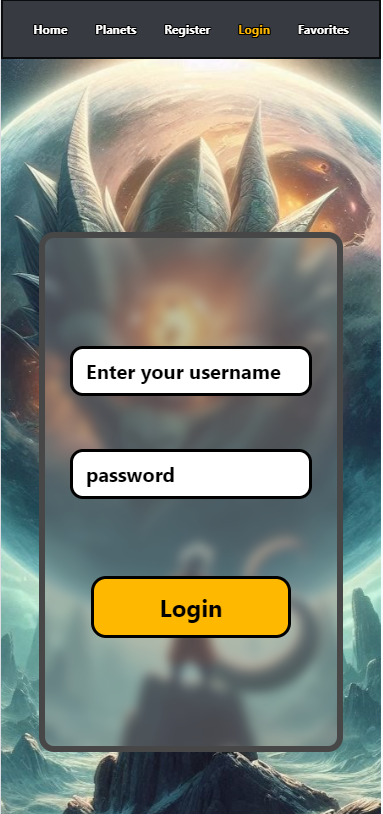

<!-- TABLE OF CONTENTS -->

  
Table of Contents

  <ol>
    <li>
      <a href="#about-the-project">About The Project</a>
      <ul>
        <li><a href="#built-with">Built With</a></li>
      </ul>
    </li>
    <li><a href="#license">License</a></li>
    <li><a href="#contact">Contact</a></li>
    
  </ol>

<!-- ABOUT THE PROJECT -->

## About The Project

Nuestro proyecto contiene 5 páginas.

En la primera página se encuentran los personajes de dragon ball sacados de una Api, divididos en varias páginas en la que se muestran 10 personajes por página.
Además, tenemos la funcionalidad del nav y el footer donde puedes redirigirte a la API, y en cada personaje se puede marcar como favorito para que luego aparezca en la página dedicada a favoritos, también hay una sección donde se puede consultar la descripción.

En la segunda página se encuentran los planetas que están dentro de la Api, con sus datos.

En la tercera página tenemos el acceso al registro de la página, en la cuál los usuarios creados se guardan con Pinia.

Dentro de la cuarta página aparece el login donde validar las credenciales.

Por último, en la quinta página, tenemos acceso a los personajes que hemos guardado en favoritos, y poder eliminarlos de la misma página de favoritos.

<b>Enlace a API:</b>
[API](https://web.dragonball-api.com/)

<b>Enlace a Presentación:</b>
[CANVA](https://www.canva.com/design/DAGJtJrWNlE/VocQkXweXYsVI1fBCQx5MQ/view?utm_content=DAGJtJrWNlE&utm_campaign=designshare&utm_medium=link&utm_source=editor)

<b>Enlace a Confluence:</b>
[CANVA](https://aitorgarcia.atlassian.net/wiki/spaces/~7120207d9ee0846c6145ac8da05bb0061a012f/pages/edit-v2/98524?)

<b>Enlace a UserFlow:</b>
[UserFLow](https://www.figma.com/board/v7pCkOA3MSuFp0XqAHchF2/Untitled?node-id=0-1&t=3AuYoIib0z0CqEDE-0)

<b>Enlace a Jira:</b>
[Jira](https://aitorgarcia.atlassian.net/jira/software/projects/TUOT/boards/5)

<b>Enlace a Figma con los prototipos:</b>
[Figma](https://www.figma.com/design/9hdweC0ElzB39S6F4KIvtw/Prototype?node-id=0-1&t=XFr4eEAziMcMvMcZ-1)

(<a href="#readme-top">back to top</a>)

### Built With

Hemos creado la web mediante el framework de Vue con las tecnologías Html, Css y Javascript.
La estructura está gestionada con Vue, creando una web con router y mediantes visats y componentes.

- [![Html][Html.com]][Html-url]
- [![Css][Css.com]][Css-url]
- [![Javascript][Javascript.com]][Javascript-url]
- [![Vue.js][Vue.com]][Vue-url]

(<a href="#readme-top">back to top</a>)

<!-- LICENSE -->

## License

None

(<a href="#readme-top">back to top</a>)

<!-- CONTACT -->

## Contact

Aitor Garcia Fernandez - [Correo](aitorgarciafernandezcv@gmail.com) 
Oscar Sordo Somohano - [Correo](oscar15-91@hotmail.com) 
Jesus Felipe Riveros Ruiz - [Linkedin](https://www.linkedin.com/in/felipe-riveros-delevoper/) 
Diego Fernandez Alonso - [Correo](diegoalnso13@gmail.com) 
Daniil Tararak - [Correo]() 

Project Link: [https://github.com/piperiver97/The-universe-of-things](https://github.com/piperiver97/The-universe-of-things)

(<a href="#readme-top">back to top</a>)

<!-- MARKDOWN LINKS & IMAGES -->
<!-- https://www.markdownguide.org/basic-syntax/#reference-style-links -->

[contributors-shield]: https://img.shields.io/github/contributors/othneildrew/Best-README-Template.svg?style=for-the-badge
[contributors-url]: https://github.com/othneildrew/Best-README-Template/graphs/contributors
[forks-shield]: https://img.shields.io/github/forks/othneildrew/Best-README-Template.svg?style=for-the-badge
[forks-url]: https://github.com/othneildrew/Best-README-Template/network/members
[stars-shield]: https://img.shields.io/github/stars/othneildrew/Best-README-Template.svg?style=for-the-badge
[stars-url]: https://github.com/othneildrew/Best-README-Template/stargazers
[issues-shield]: https://img.shields.io/github/issues/othneildrew/Best-README-Template.svg?style=for-the-badge
[issues-url]: https://github.com/othneildrew/Best-README-Template/issues
[license-shield]: https://img.shields.io/github/license/othneildrew/Best-README-Template.svg?style=for-the-badge
[license-url]: https://github.com/othneildrew/Best-README-Template/blob/master/LICENSE.txt
[linkedin-shield]: https://img.shields.io/badge/-LinkedIn-black.svg?style=for-the-badge&logo=linkedin&colorB=555
[linkedin-url]: https://linkedin.com/in/othneildrew
[product-screenshot]: images/screenshot.png
[Next.js]: https://img.shields.io/badge/next.js-000000?style=for-the-badge&logo=nextdotjs&logoColor=white
[Next-url]: https://nextjs.org/
[React.js]: https://img.shields.io/badge/React-20232A?style=for-the-badge&logo=react&logoColor=61DAFB
[React-url]: https://reactjs.org/
[Vue.js]: https://img.shields.io/badge/Vue.js-35495E?style=for-the-badge&logo=vuedotjs&logoColor=4FC08D
[Vue-url]: https://vuejs.org/
[Angular.io]: https://img.shields.io/badge/Angular-DD0031?style=for-the-badge&logo=angular&logoColor=white
[Angular-url]: https://angular.io/
[Svelte.dev]: https://img.shields.io/badge/Svelte-4A4A55?style=for-the-badge&logo=svelte&logoColor=FF3E00
[Svelte-url]: https://svelte.dev/
[Laravel.com]: https://img.shields.io/badge/Laravel-FF2D20?style=for-the-badge&logo=laravel&logoColor=white
[Laravel-url]: https://laravel.com
[Bootstrap.com]: https://img.shields.io/badge/Bootstrap-563D7C?style=for-the-badge&logo=bootstrap&logoColor=white
[Bootstrap-url]: https://getbootstrap.com
[JQuery.com]: https://img.shields.io/badge/jQuery-0769AD?style=for-the-badge&logo=jquery&logoColor=white
[JQuery-url]: https://jquery.com
[Html.com]: https://img.shields.io/badge/Html-20232A?style=for-the-badge&logo=react&logoColor=61DAFB
[Html-url]: https://www.w3schools.com/html/default.asp
[Css.com]: https://img.shields.io/badge/Css-20232A?style=for-the-badge&logo=react&logoColor=61DAFB
[Css-url]: https://www.w3schools.com/css/default.asp
[Javascript.com]: https://img.shields.io/badge/javascript-20232A?style=for-the-badge&logo=react&logoColor=61DAFB
[Javascript-url]: https://www.w3schools.com/js/default.asp
